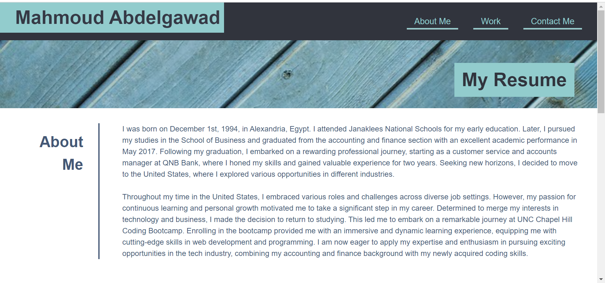
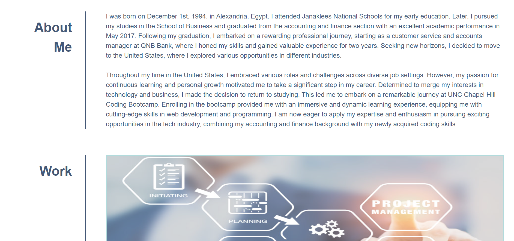
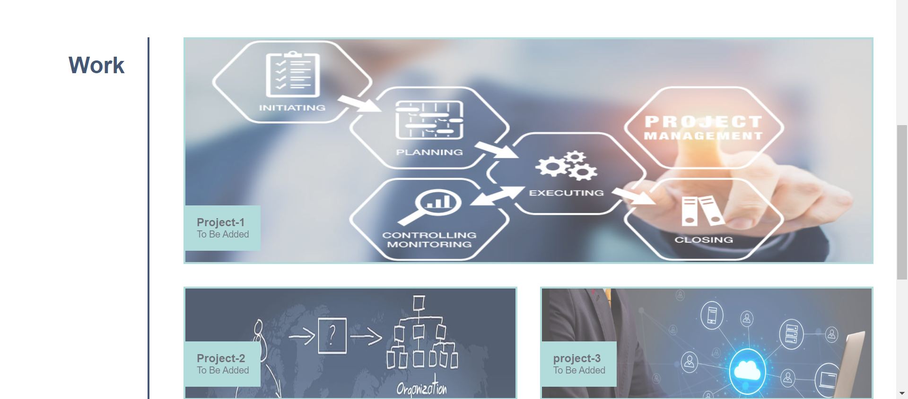
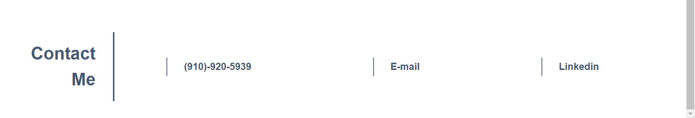

# Title
<Challenge-2_My-Resume_Web-Page>

## Description 
designed web page as to be representing my resume in a unique professional way to express myself to employers.
 That page shows a section about myself, all projects implemented by me and how should I be contacted. 
 It also represents 3 main sections and 2 titles. 
 In that web page it'll easily show all information needed for employers to find throughout the sections.
 Finally i learned how to use html5 and css in a challenging way and also a great way to practice skills I was taught and looked for in a web page that can hold much more and gets even bigger with more skills and information I'll catch along my journey in the coding bootcamp.

 ## Table of contents.

 ## Installation. 
 My Resume web page is consisted from 5 sections.
 Each section is responsible for a special part to get them all together in the end a complete form resume.

 ### Section-1:
 Is the Header contains my Name and a navigation bar consisted from 3 different links to help user toggle between the main 3 sections of the page easily.

 ### Section-2:
 Is the Hero section contains the title of the page making page preview in a good shape.

 ### Section-3:
 Is the About me section. In taht section user will find 2 paragraphs having information about myself and (my age, early education, collage degree, previous work, experience I have, and Waht I'm doing right now.)

 ### Section-4:
 Is my work in that section user will be able to discover all projects I was part of and each one of them is a link itself to view the project and find out more about it.

 ### Section-5:
 Is contact me and in that section user will be able to find out how to contact me using (phone number, e-mail address or linkedin page.)

 ## Usage.
 In section-1 there will be a navigation bar links directing user to it's corresponding section within one click.
 In section-4 there will be 5 projects labeled with names each one of them will open a window to show more about itself.
 In secton-5 there will be 3 ways of contacting .

 ## Screenshots.

### Deployed Page Link:

https://nabil1294.github.io/Challenge_2/

## Credits.

Onlie resources used.
flex-box: https://www.w3schools.com/css/css3_flexbox.asp
grid: https://www.w3schools.com/css/css_grid.asp
transition: https://www.w3schools.com/css/css3_transitions.asp
flex-box: https://www.youtube.com/watch?v=rg7Fvvl3taU
grid: https://www.youtube.com/watch?v=3elGSZSWTbM
margin & padding: https://www.youtube.com/watch?v=uEfH6qnFF6Y
em & rem: https://www.youtube.com/watch?v=_-aDOAMmDHI&t=687s

